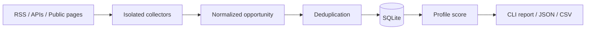

<p align="center">
  
</p>

# Global Builder Opportunity Radar

[](https://github.com/everton-soares1985/global-builder-opportunity-radar/actions/workflows/ci.yml)
[](https://www.python.org/)
[](LICENSE)

A local-first radar that turns heterogeneous public opportunity sources into one deduplicated,
ranked ledger. It targets freelance projects, contracts, grants, paid programs, prize-bearing
hackathons, and open-source bounties relevant to Python, automation, scraping, integrations, and AI
workflows. It also finds paid marketing, CRM, lead-generation, Sales Ops, RevOps, reporting, and
customer-support projects where automation is part of the solution.

## Why it exists

This project exists to find alternative income outside traditional employment. Wellfound and
InfoJobs already cover the user's job search; this radar focuses on paid outcomes, projects,
contributions, and competitions. It keeps evidence, access method, source health, and ranking logic
explicit. It does not submit applications or send outreach.

## Current sources

- Reddit `r/forhire` through RSS.
- Hacker News `Who is Hiring` through the Algolia API, currently disabled until contract-only
  filtering is implemented.
- Algora-related GitHub bounty signals through an experimental GitHub search spike.
- Opire public listings through Scrapling.
- Superteam Earn public listings through Scrapling, with Apify as a planned fallback.

Experimental collectors fail independently and report their real health instead of returning
fabricated data.

## Architecture



See the [product mission](docs/mission.md), [architecture](docs/architecture.md),
[module map](docs/module-map.md), [source admission standard](docs/source-admission.md), and
[delivery roadmap](docs/roadmap.md).

## Quick start

```powershell
git clone https://github.com/everton-soares1985/global-builder-opportunity-radar.git
Set-Location global-builder-opportunity-radar
py -3.12 -m venv .venv
.\.venv\Scripts\Activate.ps1
python -X utf8 -m pip install -e ".[dev]"
python -X utf8 -m global_builder_radar sources
python -X utf8 -m global_builder_radar collect
python -X utf8 -m global_builder_radar report --min-score 10
python -X utf8 -m global_builder_radar report --paid-only --format detailed --limit 10
```

Optional Apify support:

```powershell
python -X utf8 -m pip install -e ".[apify,dev]"
```

Copy `.env.example` to `.env` only when optional credentials are required. Never commit `.env`.

## Commands

| Command | Purpose |
|---|---|
| `sources` | Show configured sources and collector types. |
| `init-db` | Initialize the local SQLite ledger. |
| `collect` | Collect all enabled sources or selected source IDs. |
| `report` | Rank and display/export opportunities. |
| `health` | Show the last real result for every attempted source. |

Useful report filters can be combined:

```powershell
python -X utf8 radar.py report --paid-only --category bounty --limit 20
python -X utf8 radar.py report --with-contact --source hackernews_hiring --format detailed
python -X utf8 radar.py report --format json --output reports\opportunities.json
```

The table output includes terminal hyperlinks. The `detailed` format shows the description,
contact path, compensation evidence, and full source URL for each result.
Legacy `direct_job` records are hidden by default. Use `--include-traditional` only to audit the
historical ledger; it is not part of the primary product feed.

## Development

```powershell
.venv\Scripts\activate
python -X utf8 -m ruff check .
python -X utf8 -m pytest
```

Network access is not required for unit tests. Source parser changes should be backed by sanitized
offline fixtures.

## Roadmap

The ordered implementation plan and acceptance criteria live in [`docs/roadmap.md`](docs/roadmap.md).
The immediate priority is excluding traditional employment, then adding structured actionable
fields and higher-confidence project, grant, hackathon, and paid-program sources.

## License

Released under the [MIT License](LICENSE).
