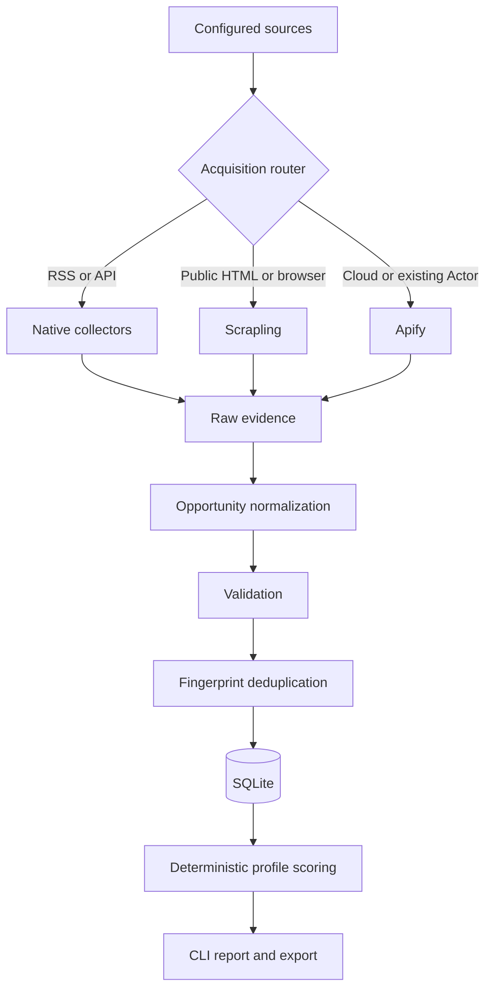
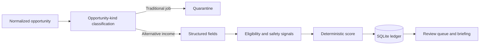

# Architecture



## Boundaries

- Collectors know how to read one source but do not write to the database.
- The domain model is source-agnostic.
- The pipeline isolates source failures and scores normalized records.
- SQLite is the canonical local ledger.
- The primary feed contains alternative-income opportunities, not ordinary permanent employment.
- Mixed sources require deterministic opportunity-kind classification before they can be enabled.
- Outreach, applications, LLM classification, Google Sheets, Spark, Hermes, and VPS deployment
  remain downstream of collection quality and review workflow.

## Collection strategy

1. Prefer official APIs and RSS.
2. Use Scrapling for public HTML and JavaScript-rendered listings.
3. Use Apify when an existing Actor, cloud execution, or proxy infrastructure has a measurable
   advantage.
4. Store source evidence and health; never fabricate successful results.

## Planned enrichment flow



AI enrichment, when introduced, annotates this flow but does not replace deterministic validation
or provenance.

## Two-dimensional classification

Do not overload the opportunity category with the work domain:

```text
opportunity kind: freelance | contract | bounty | grant | hackathon | paid_program
service domains:  software_automation | marketing_ops | crm_automation | lead_generation | ...
```

The first dimension controls scope and lifecycle. The second explains which problems and services
match the user's capabilities. A marketing-related permanent job is still `traditional_job`; a
three-month CRM automation engagement is `contract` plus `crm_automation`.
