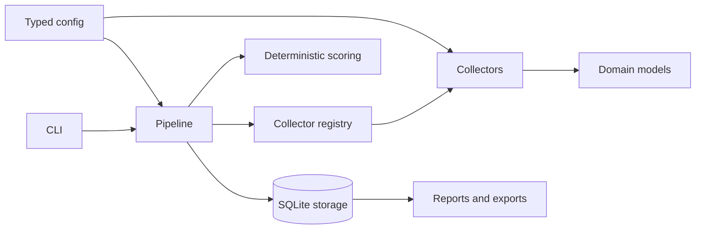

# Module map

This map defines ownership boundaries. Read the owning section before modifying a module.

## Entrypoints

| Path | Responsibility | Must not contain |
|---|---|---|
| `radar.py` | Local launcher for the Typer application. | Business logic or source parsing. |
| `src/global_builder_radar/__main__.py` | Package launcher. | Business logic or configuration. |
| `src/global_builder_radar/cli.py` | User commands, presentation, and export arguments. | Source-specific parsing. |

## Domain and configuration

| Path | Responsibility | Direct dependencies |
|---|---|---|
| `models.py` | Source-agnostic opportunity, status, category, and source models. | Pydantic and standard library. |
| `classification.py` | Deterministic opportunity-kind classifier: employment evidence first, occupation-aware keyword signals, source category fallback. | `models.py` only. |
| `service_domains.py` | Deterministic seven-domain service-area classifier (programming, automation, scraping, AI, marketing, CRM, RevOps); unknown stays unknown. | Labels never touch kind, quarantine, or ranking. |
| `github_issues.py` | Pure GitHub issue URL mapping and closed/zero-bounty verdict from public API payloads; used by the read-only `verify-github-issues` report-hygiene command. | No network in the pure layer; rows stay in SQLite. |
| `extraction.py` | Structured evidence extraction (compensation with payment-context gate, deadline, technologies, effort, conservative Brazil eligibility). | `models.py` only. |
| `config.py` | YAML/environment loading and typed configuration. | `models.py`. |
| `config/sources.yaml` | Enabled sources and acquisition settings. | Collector registry identifiers. |
| `config/profile_rules.yaml` | Deterministic profile weights and penalties. | `scoring.py`. |

## Acquisition

| Path | Responsibility | Notes |
|---|---|---|
| `collectors/base.py` | Collector protocol and shared evidence extraction. | Shared logic must be genuinely cross-source. |
| `collectors/reddit.py` | Public Reddit RSS acquisition with a requester-side title allowlist (`allowed_title_prefixes`, legacy `required_flair_prefix`); malformed or blocked feed bodies fail truthfully. | Accept project/freelance posts only. |
| `collectors/hackernews.py` | Hacker News monthly thread acquisition: broad Who-is-Hiring reader (disabled) and the freelancer-thread reader with a requester-side comment allowlist (`allowed_comment_prefixes`). | Keep thread semantics source-specific. |
| `collectors/github_bounties.py` | Retired (Phase 3.1) indirect GitHub bounty discovery; source disabled. | Not an official Algora feed; code kept for evidence. |
| `collectors/opire.py` | Opire public Next.js payload parsing; reward amount resolution prefers explicit title evidence over disagreeing `pendingPrice`. | Preserve reward IDs and repository evidence. |
| `collectors/scrapling_links.py` | Configurable public listing extraction with Scrapling; `parse_listing_page` is a pure offline-testable parser (Superteam fixture). | Use only for compatible card/link layouts. |
| `collectors/apify_actor.py` | Optional generic Apify Actor adapter. | Requires explicit credential and source enablement. |
| `registry.py` | Stable collector-name to class mapping. | Register new collectors explicitly. |

## Processing and persistence

| Path | Responsibility | Invariant |
|---|---|---|
| `pipeline.py` | Concurrent collection, failure isolation, scoring, and persistence coordination. | One source failure cannot abort the batch. |
| `scoring.py` | Deterministic profile score plus report-only basic quality/freshness signals. | Explainable and usable without AI. |
| `storage.py` | SQLite schema, upsert, lifecycle, health, and queries. | SQLite remains the canonical local ledger. |
| `briefing.py` | Pure deterministic renderer of the Phase 4A self-contained HTML briefing; escapes every source-derived value and keeps unknowns as `Unknown`. | Render-only: no network, no AI, no database writes. |
| `logging_config.py` | Structured runtime logging. | No application decisions. |

## Tests

| Path | Coverage |
|---|---|
| `tests/test_models.py` | URL normalization and identity. |
| `tests/test_classification.py` | Opportunity-kind classification against the mixed-source fixture. |
| `tests/test_pipeline.py` | Classification and service-domain labeling in the pipeline plus source failure isolation. |
| `tests/test_extraction.py` | Email and compensation evidence extraction. |
| `tests/test_extraction_structured.py` | Structured fields: valid, unknown, misleading, and preservation cases. |
| `tests/test_review_findings.py` | Offline regressions for every blocking item in `docs/review-findings.md`. |
| `tests/test_scoring.py` | Deterministic ranking behavior and the basic quality/freshness signals. |
| `tests/test_storage.py` | Upsert, filtering, status, persistence, service-domain column, and legacy migration. |
| `tests/test_reddit_rss.py` | Reddit RSS admission: requester-side allowlist, rejected conventions, empty/malformed/blocked feeds, stable IDs. |
| `tests/test_hn_freelancer.py` | HN freelancer-thread admission: requester-side allowlist, worker-ad/chatter/flagged rejection, truthful zeros, stable IDs. |
| `tests/test_scrapling_links.py` | Superteam-style listing parsing: card titles, dedup, pattern rejection, truthful empty page, max_items, prize-pool honesty. |
| `tests/test_service_domains.py` | Seven-domain classification: per-domain signals, boundaries, unknown stays unknown, kind independence. |
| `tests/test_github_issues.py` | GitHub issue URL mapping, zero-bounty label detection, closed/zero verdict from API payloads. |
| `tests/test_briefing.py` | Briefing renderer: hostile-text escaping, card evidence and honest unknowns, factual grouping/filters, disabled-source exclusion, no ledger mutation. |
| `tests/test_opire.py` | Opire payload parsing. |

New source parsers require a sanitized offline fixture under `tests/fixtures/` and focused parser
tests. Live network calls are smoke tests, not substitutes for fixtures.

## Dependency direction

Dependencies must point inward toward domain models. Storage, scoring, and integrations must never
be imported by collectors.
